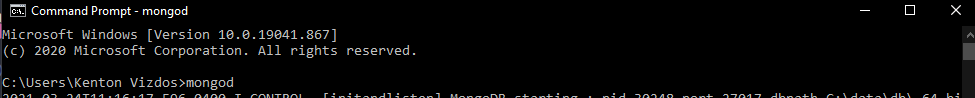
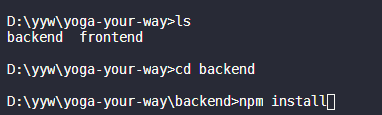
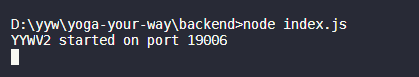
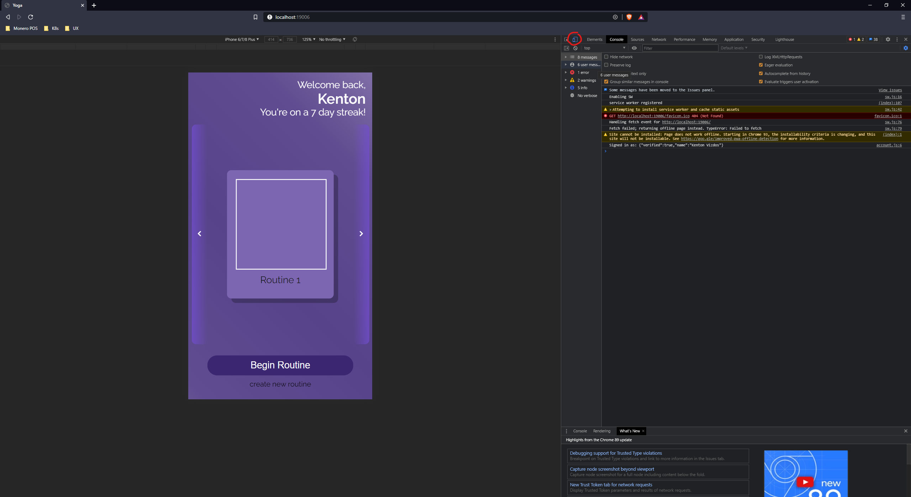

# Deployment & Development
1. Install NodeJS + MongoDB
    - Download MongoDB Community Edition from [here](https://docs.mongodb.com/manual/installation/)
    - Download the LTS version of NodeJS from [here](https://nodejs.org/en/download/) 
2. In it's own terminal, start MongoDB (run `mongod`)
    - Open a new terminal (start key, run `cmd`)
    - **THIS MUST BE LEFT RUNNING IN THE BACKGROUND AS YOU CODE**
    - 
3. Download this repo (either using the zip download, or `git clone https://github.com/kvizdos/Yoga-Your-Way.git`)
    - Make sure to remember the location of the root directory
4. In a new terminal, run `npm install` in the ./backend directory
    - `$ cd ROOT_DIRECTORY_HERE` (e.g. for me, D:\yyw\yoga-your-way)
    - `$ cd backend`
    - `$ npm install`
    - In the screenshot below, `D:\yyw\yoga-your-way` will be refered to as the root directory
    - 

5. Run `node index.js` in the ./backend directory
    - 

6. Connect to page at `http://localhost:19006`
    - Enter development mode by hitting `ctrl + shift + i`
    - Enter device preview mode by selecting that little phone icon at the top left of the inspector pane (circled in red below)
    - 
7. Every time you make a change to the backend, you need to restart the node server (from step 5). This can be done automatically using a tool like nodemon
    - `$ npm install nodemon -g`
    - `$ nodemon index.js`